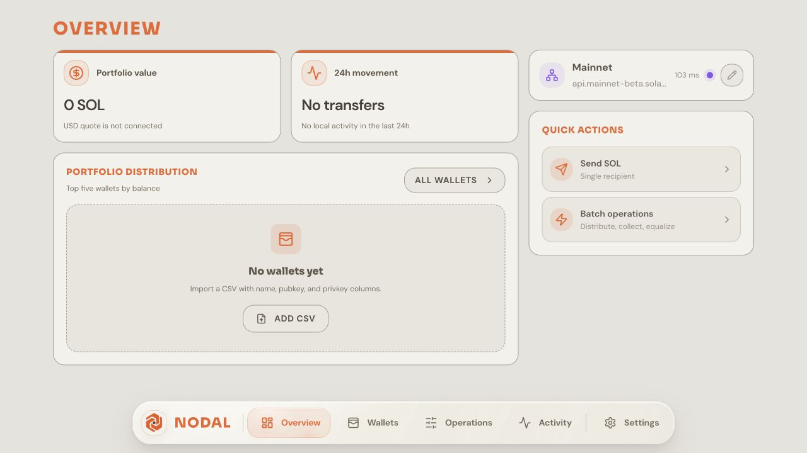
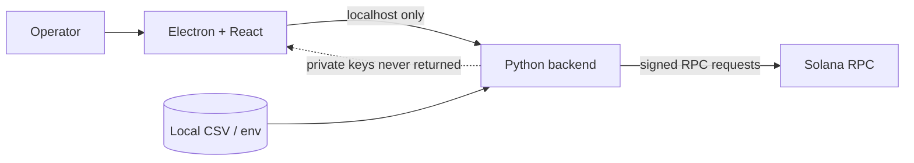

# NODAL

**A local-first Solana operations desk for people who need to inspect, organize, and move assets across multiple wallets without sending private keys to a hosted service.**

[Source](https://github.com/eerinessofsilence/sol_cli_wallet) · [Configuration](.env.example)



> **Status:** functional desktop and CLI prototype. Use devnet and disposable wallets first; this software has not received an independent security audit.

## What it delivers

- Imports Base58 keys and JSON key arrays into a searchable local wallet list.
- Shows SOL, SPL token, and NFT balances from the selected RPC endpoint.
- Reviews amount and fees before signing SOL, token, or NFT transfers.
- Runs batch distribution, consolidation, and balance-equalization workflows.
- Checks RPC health and imports wallet records from CSV.
- Keeps signing material inside the local Python process instead of returning it to the renderer.

## Data flow



## Quick start

```bash
git clone https://github.com/eerinessofsilence/sol_cli_wallet.git
cd sol_cli_wallet
python3 -m venv venv
source venv/bin/activate
pip install -r requirements.txt
cp .env.example .env
cd desktop-ui && npm install && cd ..
python3 run_desktop.py
```

The desktop window should open and show the Overview screen. Point `CSV_FILE` in `.env` to a CSV with the header `name,pubkey,privkey`; use the interactive CLI with `python3 main.py`.

## Checks, security, and limits

```bash
cd desktop-ui
npm run typecheck
npm run build
```

- Never commit `.env` or wallet CSV files; both may contain signing material.
- The backend binds to `127.0.0.1`, but the host machine and chosen RPC endpoint remain part of the trust boundary.
- There is no hardware-wallet integration, encrypted keystore, reproducible release, or external audit yet.
- Always verify addresses, network, assets, and fees before signing a transaction.

## License

The repository is public for portfolio and evaluation purposes. No open-source license is currently included.
